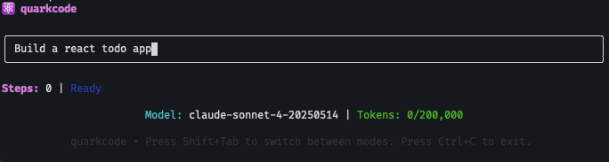

# quarkcode

Minimal CLI agent with a TUI.



These CLI agents are a dime a dozen, and this wasn't built with the intent to replace them. It's functional, but not polished.

Initially inspired by [mini-swe-agent](https://github.com/SWE-agent/mini-swe-agent), the goal was to build a powerful CLI + TUI agent in ~1k lines of code or less (mini-swe-agent is around ~4k in total). Using JS instead of TS would have resulted in even less code, but oh well.

Claude Code helped write the non-interactive version, then I switched to quarkcode to build the TUI and other features.

Why "quark"? Among the most fundamental particles we know. And just a unique name.

## Details

- 858 lines of code (as of this README commit)
  - For all code, types, prompts, and configuration (`wc -l src/**/* 2>/dev/null | tail -1`)
- Interactive TUI (similar to Claude Code)
  - One-shot (will not remember previous messages)
  - Asks for confirmation before executing commands
  - shift+tab to toggle auto-accept mode (yolo mode)
- A single tool: Bash
- _Potentially_ resolves ~67% of GitHub issues in the [SWE-bench verified benchmark](https://www.swebench.com/) (will not be spending $ to re-verify this)
- Supports models from Anthropic and OpenAI, but any model supported by the AI SDK can be added easily
- Written in TypeScript, targeting the Bun runtime
- Minimal dependencies
  - AI SDK (anthropic, openai)
  - Ink (TUI)
  - yargs (CLI)

## Quickstart

⚠️ **Warning**: This agent has direct access to bash. Be careful with auto-accept mode.

```bash
# Set ANTHROPIC_API_KEY or OPENAI_API_KEY in your environment
export ANTHROPIC_API_KEY="your_key_here"
# Via bunx
bunx quarkcode  # Interactive mode
bunx quarkcode -t "Fix the bug in main.py"
```

## TUI Shortcuts

- `Ctrl+C` - Exit
- `Shift+Tab` - Toggle auto-accept mode
- **Command confirmation**: `Y`/`Enter` = approve, `N`/`Escape` = reject

## CLI Flags

- `-t, --task` - Task to execute in non-interactive mode
- `-m, --model` - LLM model
- `-l, --token-limit` - Max tokens
- `-s, --step-limit` - Max steps
- `--tui` - Launch TUI
- `-h, --help` - Show help

## Models

- `claude-sonnet-4-20250514` (default)
- `gpt-5`
- any other OpenAI or Anthropic model (untested)

## Quickstart in a docker container

Work on any project by mounting it into /workspace:

```bash
# 1. Build image (one time)
git clone <repo> && cd quarkcode && docker build -t quarkcode .

# 2. Configure API key
echo "ANTHROPIC_API_KEY=your_key_here" > .env

# 3. Set your project path
export PROJECT_DIR="/path/to/your/project"

# 4. Run tasks
docker run --rm -it -v $PROJECT_DIR:/workspace --env-file .env -w /workspace quarkcode -t "Fix the bug in main.py"

# 5. Interactive mode
docker run --rm -it -v $PROJECT_DIR:/workspace --env-file .env -w /workspace quarkcode
```

## Local Development

`bun run agent` will run in docker.

```bash
# Interactive TUI in docker (default when no task provided)
bun run agent

# Direct task execution
bun run agent -t "Create a simple React component"

# Build + run
bun run agent:b
```
